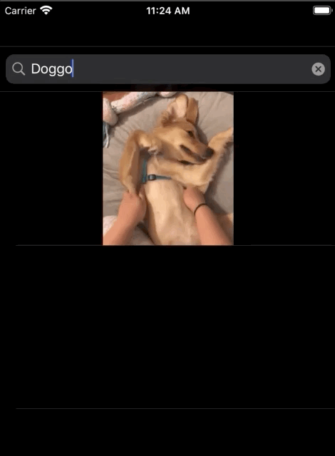
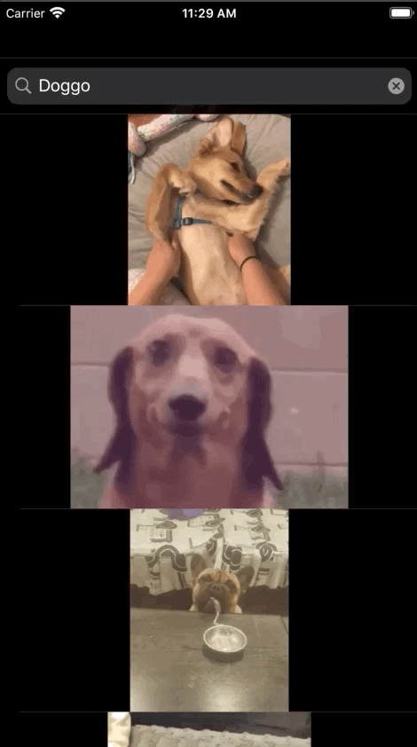

Now that we have our network finished we can go ahead and populate our tableView based on our **search query**.

We will need to edit some of the properties inside of our **tableView** and also add the Gif into our **tableView cell**.

# Editing the TableView Cell

> [action]
> Navigate to our **tableView cell** called `GifCell`. Currently we don't have any views inside of it.
>
> To **display our gif** we will need to add something called a `UIImageView`. ImageViews are used to display images.
>
> Change the code inside your `GifCell` to the following:
>
```
import UIKit
class GifCell: UITableViewCell {
    /// Gif to be displayed.
    var gif: Gif?
    /// ImageView to contain our gif.
    var gifView: UIImageView = {
        let v = UIImageView()
        v.contentMode = .scaleAspectFit
        return v
    }()
    override func layoutSubviews() {
        super.layoutSubviews()
        // Make sure cell has a gif object
        if gif != nil {
            // Grab gif from gif object and display it inside the imageview
            let gifURL = gif!.getGifURL()
            gifView.image = UIImage.gif(url: gifURL)
            gifView.frame = CGRect(x: 0, y: 0, width: bounds.width, height: bounds.height)
            addSubview(gifView)
        }
    }
    override init(style: UITableViewCell.CellStyle, reuseIdentifier: String?) {
        super.init(style: style, reuseIdentifier: reuseIdentifier)
    }
    required init?(coder aDecoder: NSCoder) {
        super.init(coder: aDecoder)
    }
}
```
>
> Now we have a Gif object inside our tableView and also an imageView to display our gif!
>

# Editing our TableView

> [action]
> Now that we have our **GifCell** all ready to display gifs we will need to edit some of the properties for our **tableView**.
>
> Navigate to our **tableView extension** inside the ViewController class.
>
> Change the function **numberOfRowsInSection** to `return gifs.count` instead of `1`. This will allow our tableView to display all of our gif objects.
>
> Great! Now all we need to do is pass the Gif object into our cell. To do this navigate to **cellForRowAt**.
>
> Underneath where we create our cell `let cell = tableView.dequeueReusableCell(withIdentifier: "gifCell") as! GifCell` we need to pass in our gif object.
>
> To do this add the following code:
> `cell.gif = gifs[indexPath.row]`
>
> Now our cell will be populated with the gif object that we fetch from the Giphy API.
>

# Search for a gif!

Press `Command + R` and run the program. Type something into the search bar and search. You should now see a **gif displayed into your tableView!**



# Displaying more then one gif!

Currently we are **only displaying one gif**...gifs are a lot of data and it takes Xcode time to display them. To change this navigate back to our `GifNetwork` and find our `urlBuilder` function.

Inside the query items we have a **limit set to 1** try changing it to a higher value like 5.

Press `Command + R` and run the program and you should now see **more gifs displayed!**



# All Done!

**Awesome job! Now we are all done building the GiphySearch project.**

In this tutorial you learned:

- How to use **StoryBoard** to create a tableView with custom cells.
- How to create a **URLSession Task** to fetch data from the Giphy API.
- How to use **decodable** to convert JSON data into our own custom objects!
